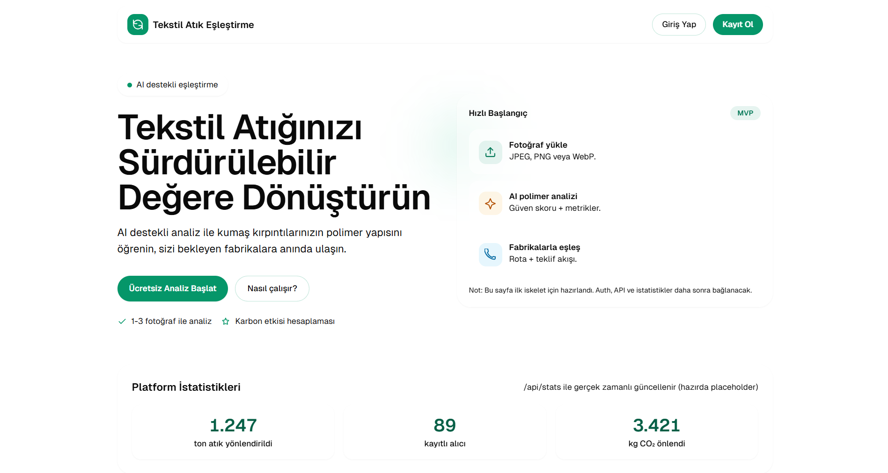
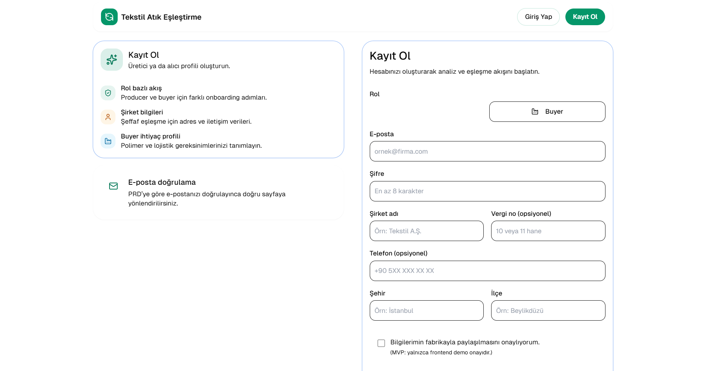
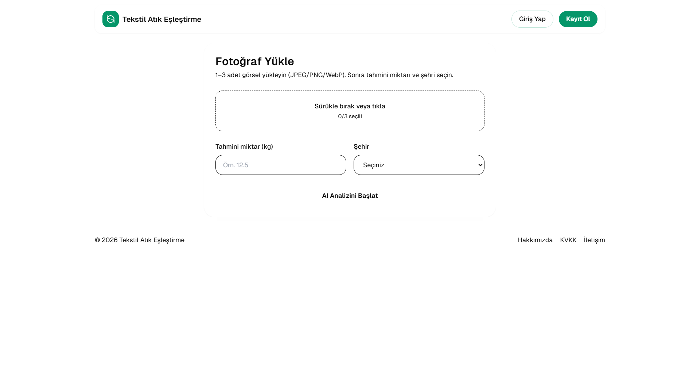
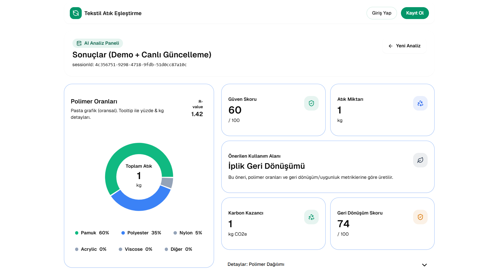
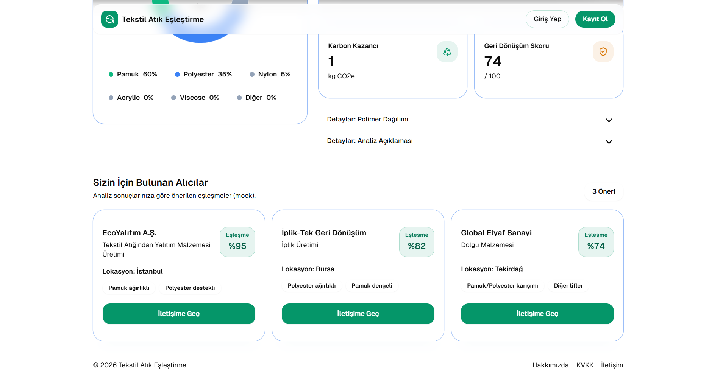

# Tekstil Atık Eşleştirme Platformu

## 🚀 Proje Bağlantıları

- 🌍 **Canlı Site (Yayın Linki):** [https://tekstil-atik-eslestirme.vercel.app/](https://tekstil-atik-eslestirme.vercel.app/)
- 🎬 **Proje Demo Videosu:** [https://www.loom.com/share/fa82fa9dee044b90954da26deb3a334a](https://www.loom.com/share/fa82fa9dee044b90954da26deb3a334a)

---

Modern, veri odaklı ve yapay zekâ destekli bir tekstil atık eşleştirme deneyimi sunan portfolyo projesi.

---

## Proje Amacı

Tekstil endüstrisi, her yıl milyonlarca ton karmaşık atık üreterek çevre üzerinde ciddi bir baskı oluşturuyor. Bu atıkların döngüsel ekonomiye kazandırılmasının önündeki en kritik engel ise kumaşların içeriğindeki polimer karışım oranlarının (pamuk, polyester vb.) hızlı ve güvenilir biçimde tespit edilememesi. Tekstil Atık Eşleştirme Platformu, tam olarak bu endüstriyel probleme odaklanarak geliştirildi. Kullanıcıların sisteme yüklediği atık kumaş fotoğrafları, Google Gemini altyapısı ile saniyeler içinde analiz ediliyor; gelişmiş görsel yorumlama sayesinde kumaşın polimer yapısı yüksek doğrulukla tahmin edilerek karar süreçleri veriyle destekleniyor. Elde edilen analiz sonuçları, atıkların çöpe gitmesini önlemek için onları uygun yalıtım malzemesi üreticilerine veya iplik geri dönüşüm tesislerine yönlendiren akıllı bir eşleştirme akışına dönüştürülüyor. Bu yaklaşım, yalnızca operasyonel verimlilik sağlamıyor; aynı zamanda karbon ayak izini azaltan, kaynak kullanımını iyileştiren ve sürdürülebilirlik performansını ölçülebilir hale getiren bir dönüşüm modeli sunuyor. Next.js, Supabase ve Vercel ile güçlendirilen modern mimarisiyle bu platform, klasik bir yazılım ürününün ötesinde, atığı değerli bir hammaddeden yeniden ekonomik katma değere dönüştüren dijital bir köprü ve sıfır atık vizyonuna yönelik güçlü bir adımdır.

---

## Teknoloji Yığını

Proje geliştirme sürecinde aşağıdaki temel teknolojiler kullanıldı:

- **Next.js** - Modern, hızlı ve SEO dostu web arayüzü
- **Gemini API** - Yapay zekâ destekli analiz ve akıllı öneriler
- **Vercel** - Hızlı deployment ve kesintisiz yayınlama altyapısı
- **Supabase** - Gerçek zamanlı veritabanı ve backend servisleri

---

## Uygulama Görselleri

  
  

  
  

  

---

## Kısa Not

Bu README, projeyi portfolyo sunumu için sade, profesyonel ve etkileyici bir yapıyla tanıtmak üzere hazırlandı.